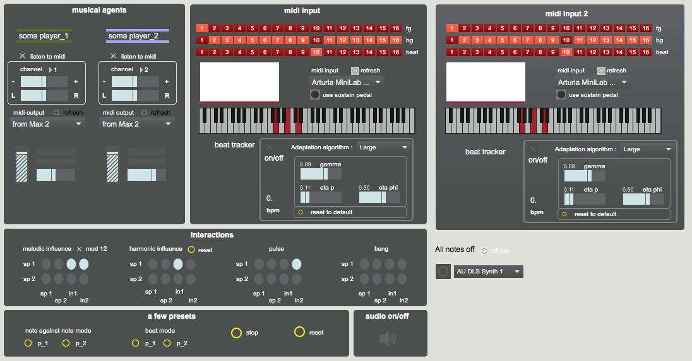
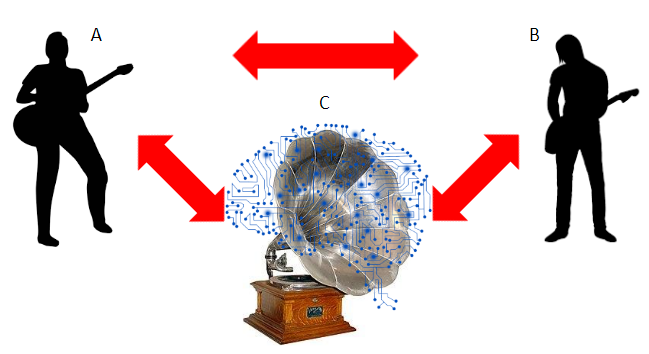

# Somax (Multi-Input)

Somax improvisation software

Multi-input branch extends capability to use two MIDI inputs for a single conductor.

## Usage

To use Somax with multiple midi inputs, clone/download this branch of this repository and use "conductor_midi_2.maxpat". A screenshot is shown below.

In each midi input panel, ensure the correct input is selected from the “midi input” dropdown menu. 

The interaction matrix has also been expanded to include the second midi input. The third column now corresponds to the left input panel, and the fourth column now corresponds to the right input panel. To have both inputs influence the player, select both columns (as shown on the leftmost matrix). Otherwise, input can be independently sent to each player by selecting one column, but not the other.

More details can be found on [this doc](https://docs.google.com/document/d/1QqxMyi0h6fnYnYvSFoIwf5hZQuR3IVUc_eEhqW881cY/edit?usp=sharing)

## Experimental Design

1. Resting state with eyes closed and open

2. Free improvisation between two guitarists

3. Free improvisation with the machine cooperating with guitarist A

4. Free improvisation with the machine cooperating with guitarist B

5. Free improvisation with the machine cooperating with both guitarists (A & B)

6. Free improvisation between all three agents with pre-recorded material of C

## Notes

Conception G. Assayag, L. Bonnasse-Gahot

Version 1.45 Laurent Bonnasse-Gahot, Max 7 64 bits adaptation and python corpus builder by Axel Chemla

Version 2.O has been totally redesigned an developed by Axel Chemla

Readings on Somax: http://repmus.ircam.fr/somax/home

Readings on the DYCI2 Project : http://dyci2.ircam.fr

Complete corpus folder including soundfiles : https://nubo.ircam.fr/index.php/s/8X6eZ7HZD4pCDnC